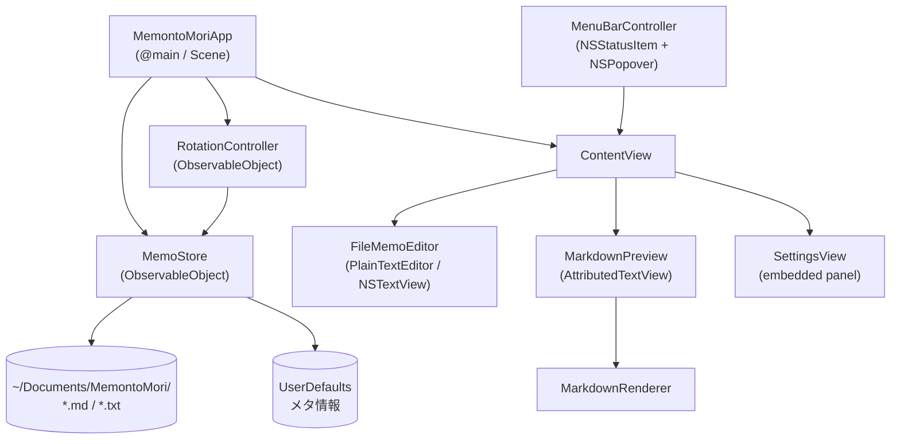
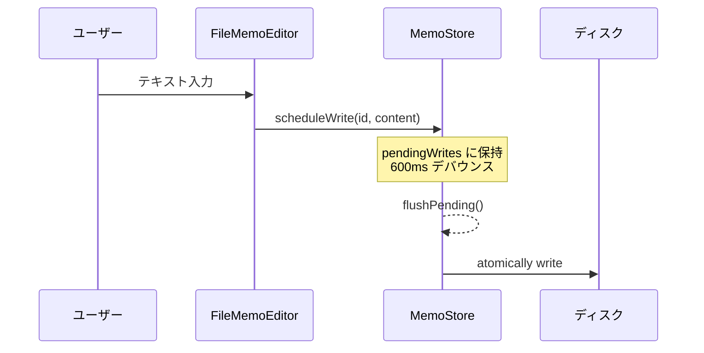

# アーキテクチャ

MemontoMori は SwiftUI + AppKit のハイブリッド構成です。メニューバー常駐や `NSTextView` の細かい制御など SwiftUI だけでは届かない部分を AppKit で補っています。

## コンポーネント全体図

## 責務の分割

| 型 | 種別 | 役割 |
| --- | --- | --- |
| `MemontoMoriApp` | `App` | エントリポイント。`MemoStore` と `RotationController` を生成し環境に注入。 |
| `MemoStore` | `ObservableObject` | ファイルの読み書き、再スキャン、サブフォルダ管理、設定値の永続化。 |
| `RotationController` | `ObservableObject` | アイドル検知、自動ローテーション、表示中メモの管理。 |
| `ContentView` | `View` | メイン UI。エディタ／プレビュー／設定パネルの切り替えとフッター操作。 |
| `SettingsView` | `View` | ファイル一覧・フォルダ選択・動作設定。埋め込み／独立の両対応。 |
| `MarkdownRenderer` | `enum` + パーサ | Markdown → `NSAttributedString` の自前変換。 |
| `MenuBarController` | `class` | `NSStatusItem` と `NSPopover` の管理（メニューバー常駐）。 |
| `MemoEntry` | `struct` | 1メモのメタ情報（`id` = ファイル名, `isEnabled`）。 |

## データフロー

### 編集 → 保存（デバウンス書き込み）

ユーザーがテキストを打つたびにディスクへ書くのは無駄なので、`MemoStore.scheduleWrite(id:content:)` で 600ms のデバウンスをかけてから保存します。

:::note 切り替え時の取りこぼし防止
メモを巡回・切り替える直前に `store.flushPending()` を呼び、保留中の書き込みを確実にディスクへ反映してから次のメモへ移ります。
:::

### 起動 → 一覧の構築

`MemoStore` はファイルシステムを正とし、`UserDefaults` に保存した順序・有効状態を **重ね合わせ** て一覧を作ります。

1. ディレクトリを走査し、`.md` / `.txt` の現存ファイル名を収集。
2. 保存済みの並び順のうち、現存するものだけを残す。
3. 新規に増えたファイルを末尾に追加（デフォルトで有効）。
4. 消えたファイルのエントリは破棄。

この「ファイル正・メタ情報は補助」という方針により、Finder からの追加・削除・リネームと自然に共存します。

## なぜ AppKit を併用するのか

- **メニューバー常駐**: `NSStatusItem` / `NSPopover`（SwiftUI の `MenuBarExtra` 以前からの実装）。
- **テキスト編集**: `NSTextView` を `NSViewRepresentable` でラップし、スマートクオート等の自動置換を無効化（Markdown が壊れないように）。
- **最前面表示**: `NSWindow.level` を直接操作（[Always on Top](./features/always-on-top.md)）。
- **入力監視**: `NSEvent.addLocalMonitorForEvents` でアイドル検知（[Memo Rotation](./features/memo-rotation.md)）。
