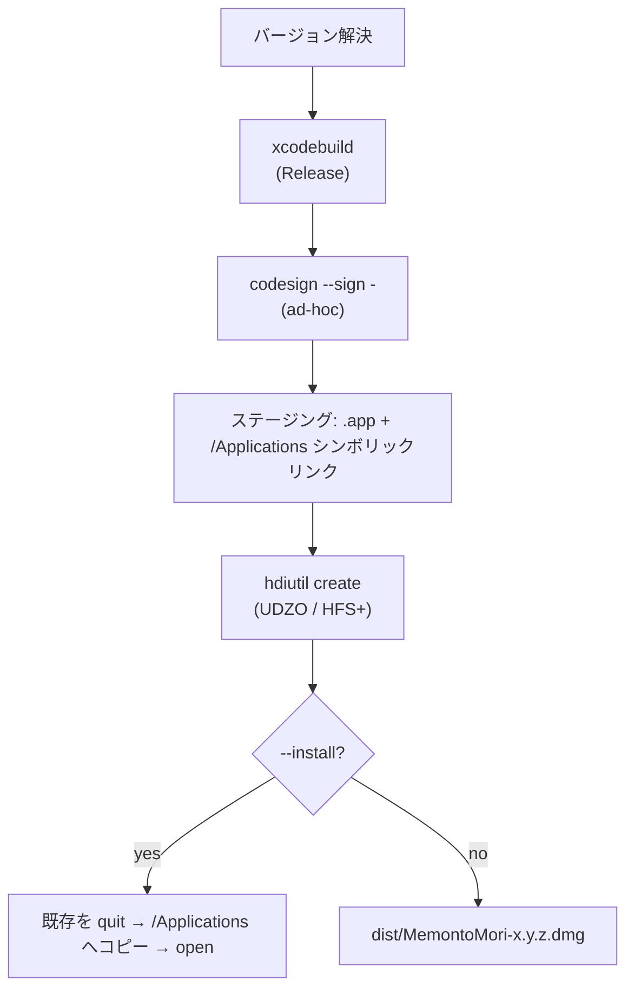

# ビルドとリリース

MemontoMori は未署名（ad-hoc 署名）の DMG として配布します。ローカルビルドと GitHub Actions による自動リリースの両方を用意しています。

> 由来: PR #6「add DMG installer build script and release workflow」

## 必要要件

- Xcode（macOS）
- 追加の Homebrew パッケージは不要

## ローカルビルド

`scripts/build-dmg.sh` が、Release ビルド → ad-hoc 署名 → DMG 作成までを一括で行います。

```bash
# DMG を ./dist に作成
./scripts/build-dmg.sh

# DMG を作って /Applications に展開し、そのまま起動
./scripts/build-dmg.sh --install

# バージョン文字列を上書き（DMG ファイル名に反映）
./scripts/build-dmg.sh --version 1.2.3
```

### スクリプトの流れ



バージョンは `--version` 指定がなければ `project.pbxproj` の `MARKETING_VERSION` から自動抽出します。

```bash title="scripts/build-dmg.sh（抜粋）"
VERSION="$(grep -m1 -E 'MARKETING_VERSION = ' "${PROJECT}/project.pbxproj" \
  | sed -E 's/.*MARKETING_VERSION = ([^;]+);.*/\1/' | tr -d ' ')"
```

## GitHub Actions による自動リリース

`.github/workflows/release.yml` が `v*` タグの push をトリガーに、macOS runner で DMG をビルドし Releases に添付します。

```bash
git tag v1.0.0
git push origin v1.0.0
```

| トリガー | 挙動 |
| --- | --- |
| `v*` タグ push | DMG ビルド → artifact 添付 → **GitHub Release を自動作成**（リリースノート生成） |
| `workflow_dispatch`（手動） | DMG ビルド → artifact 添付のみ（Release は作られない） |

```yaml title=".github/workflows/release.yml（抜粋）"
on:
  push:
    tags: ['v*']
  workflow_dispatch:
    inputs:
      version:
        description: 'Version string (used in DMG filename).'
        required: false
        type: string
```

## インストール時の Gatekeeper

未署名配布のため、初回起動は Gatekeeper に止められます。利用者には次のいずれかを案内します。

1. **右クリック → 開く** → 確認ダイアログで **開く**。
2. 一度起動を試した後、**システム設定 → プライバシーとセキュリティ** の **このまま開く**。

一度許可すれば以降は通常どおりダブルクリックで起動できます。

:::warning 署名について
Apple Developer Program 未加入のため ad-hoc 署名（`codesign --sign -`）で配布しています。動作上の問題はありませんが、公証（notarization）はされていません。配布時はこの点を README でも明記しています。
:::
</content>
