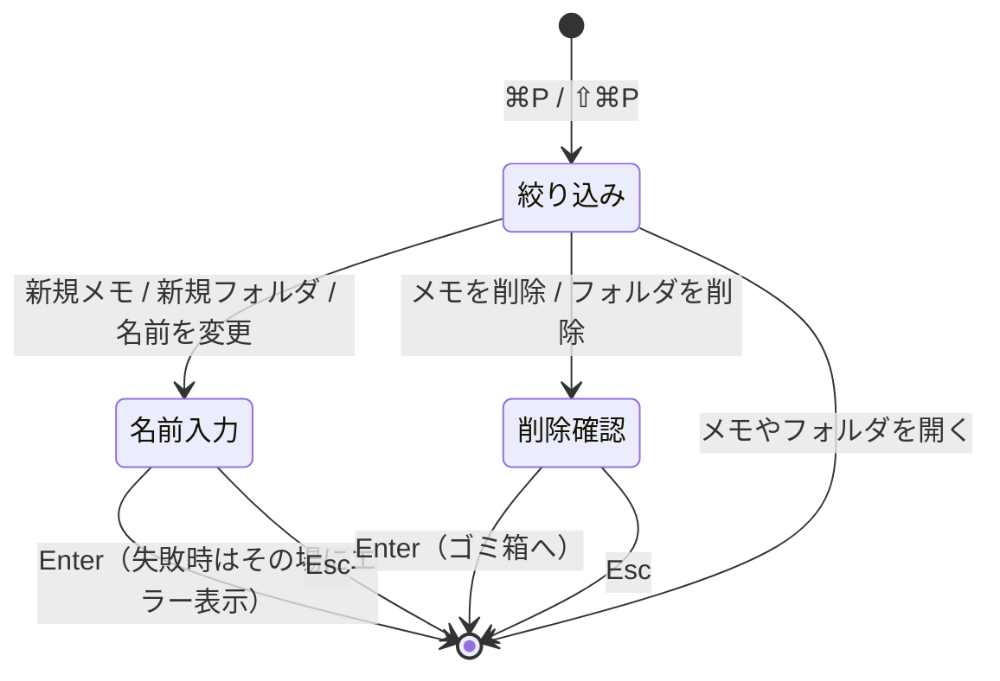

# コマンドパレット

<kbd>⌘</kbd><kbd>P</kbd> でファイル・フォルダの検索、<kbd>⇧</kbd><kbd>⌘</kbd><kbd>P</kbd> でコマンドの実行ができます。VS Code のコマンドパレットと同じ操作感で、**入力した文字が順番どおり含まれていれば拾う** fzf 方式の絞り込みです。

```
┌──────────────────────────────────────────────┐
│ 🔍 wsd                                       │  ← 入力欄（先頭が > ならコマンド）
├──────────────────────────────────────────────┤
│ 📄 daily.md                                  │  ← 太字が一致した文字
│    work/standup                              │
│ 📄 review.md                                 │
│    work/standup                              │
│ 📁 standup                          フォルダ │
│    work                                      │
├──────────────────────────────────────────────┤
│ ↑↓ 移動  Tab 取り込み  Enter 決定  Esc 閉じる │
└──────────────────────────────────────────────┘
```

## 使い方

### 開く

| キー / メニュー | 動作 |
| --- | --- |
| <kbd>⌘</kbd><kbd>P</kbd> | ファイル・フォルダ検索で開く |
| <kbd>⇧</kbd><kbd>⌘</kbd><kbd>P</kbd> | コマンド実行（入力欄が `>` で始まった状態）で開く |
| メニュー「コマンド」→ 新規メモ / 新規フォルダ | 名前入力の状態で直接開く |

同じ項目をもう一度選ぶと閉じます。パレットは左ペインもフッターも含めたウィンドウ全体に重なり、背景をクリックしても閉じられます。

### パレット内のキー操作

| キー | 動作 |
| --- | --- |
| <kbd>↑</kbd> / <kbd>↓</kbd>（<kbd>⌃</kbd><kbd>P</kbd> / <kbd>⌃</kbd><kbd>N</kbd>） | 候補を移動（端で反対側へ回り込む） |
| <kbd>Tab</kbd> | 選択中の候補を入力欄に取り込む（fzf-tab のように、そこからさらに絞り込める） |
| <kbd>Enter</kbd> | 決定（開く / 実行 / 作成・リネームの確定 / 削除の確定） |
| <kbd>Esc</kbd> | 閉じる |

<kbd>⌃</kbd><kbd>P</kbd> / <kbd>⌃</kbd><kbd>N</kbd> は macOS の標準キーバインドがそれぞれ `moveUp:` / `moveDown:` に落ちるため、追加の実装なしでそのまま候補移動になります。

### ファイル・フォルダ検索

入力欄がそのままのときは、**ルート配下のすべてのメモとフォルダ**が対象です。選択中フォルダの中だけではありません。

- メモを選ぶと、必要ならそのフォルダへ切り替えてから表示します。
- フォルダを選ぶと、そのフォルダに切り替えて祖先を展開します。
- 照合はルートからの相対パス全体（`work/standup/daily.md`）に対して行うので、フォルダ名も混ぜて絞り込めます。
- 何も入力していないときは、いま開いているフォルダの中身が上に並びます。

### コマンド実行

入力欄の先頭が `>` のときはコマンド一覧になります。`>` を消せばファイル検索に戻ります。日本語のタイトルだけでなく `new file` / `rename` / `trash` のような英語の別名でも引けます。

**いま実行できないコマンドは一覧に出ません。** 画像を表示しているときに「Markdown プレビューを切り替え」が出ない、ルートを選択中に「フォルダを削除」が出ない、といった具合です。

対応しているコマンドの全体像は[設定ページ](./settings-page.md)の「コマンド」セクションにも同じ内容が並びます。追加のたびに 2 か所を書き換えずに済むよう、どちらも `CommandCatalog` を読んでいます。

### 作成・リネーム・削除

パレットを閉じずに、そのまま次の段階へ進みます。



作成では**パスを書けます**。

| 入力 | 結果 |
| --- | --- |
| `todo` | 現在のフォルダに `todo.md` |
| `todo.txt` | 現在のフォルダに `todo.txt`（対応拡張子はそのまま） |
| `work/2026/todo` | 現在のフォルダの下に `work/2026/` を作り、その中に `todo.md` |
| `/inbox/todo` | **ルート**の下に `inbox/` を作り、その中に `todo.md` |

リネームは表示中のメモ・選択中のフォルダが対象です。拡張子を省略すると元の拡張子のままになります。削除はどちらも確認をはさんでゴミ箱へ移動します（`trashItem` なので Finder から戻せます）。

:::tip 左ペインからも同じことができます
[フォルダツリー](./folder-sidebar.md)の右クリックメニューにも「名前を変更...」が追加されています。マウスで操作したいときはそちらが早く、キーボードから離れたくないときはパレットが早い、という住み分けです。
:::

## 仕組み

### 絞り込み（`FuzzyMatcher`）

fzf と同じサブシーケンス照合です。実装は 2 段階で、**前から貪欲に走査して一致の有無と終端を求め、そこから後ろ向きに詰め直す**という形をとっています。前向きだけだと一致が候補の前方に散らばり、`ab` が `a……b` のように離れて拾われてしまうためです。

```swift title="FuzzyMatcher.swift（抜粋）"
// まず前から貪欲に走査し、一致するかどうかと終端位置を求める。
for (index, character) in lowered.enumerated() {
    if character == pattern[patternIndex] {
        patternIndex += 1
        lastIndex = index
        if patternIndex == pattern.count { break }
    }
}
guard patternIndex == pattern.count else { return nil }

// 次に終端から後ろ向きに詰め直す。
var cursor = pattern.count - 1
var index = lastIndex
while cursor >= 0 && index >= 0 {
    if lowered[index] == pattern[cursor] {
        matched[cursor] = index
        cursor -= 1
    }
    index -= 1
}
```

スコアは並べ替えのためだけの相対値です。

| 加点 / 減点 | 条件 |
| --- | --- |
| +20 | 候補の先頭に一致 |
| +14 | `/` `_` `-` `.` ` ` の直後、または camelCase の切れ目に一致 |
| +12 | 直前の一致から続けて一致（連続） |
| −1 / 文字 | 一致と一致の間に挟まった文字（−24 で打ち止め） |
| −長さ/8 | 同じような一致なら短い候補を上に |

パレット側ではさらに、**ファイル名だけに当たったものへ +30**、**現在のフォルダの項目へ +8** を足しています。`daily` と打ったときに、たまたまフォルダ名で引っかかった別のメモより `daily.md` が上に来るようにするためです。

一致した位置（`matchedIndices`）はハイライトにも使います。パスの前半に当たった文字はフォルダ名（副題）側、後半はファイル名側と、添字をずらして振り分けています。

### コマンドの定義は 1 か所（`CommandCatalog`）

コマンドは `CommandID` の列挙と、そこから引く `CommandDescriptor`（タイトル・説明・別名・ショートカット・アイコン・分類）で表します。**`descriptor` を `switch` で書く**ことで、コマンドを足したときの定義漏れをコンパイラが教えてくれます。

```swift title="CommandCatalog.swift（抜粋）"
extension CommandID {
    /// `switch` で網羅させることで、コマンドを足したときに定義漏れをコンパイラに検出させる。
    var descriptor: CommandDescriptor {
        switch self {
        case .newMemo:
            return CommandDescriptor(
                id: self,
                category: .file,
                title: "新規メモ",
                summary: "現在のフォルダにメモを作ります。...",
                keywords: ["new file", "create memo", "touch", "sakusei"],
                shortcut: nil,
                systemImage: "square.and.pencil"
            )
        // ...
        }
    }
}
```

実際の処理は `CommandPalette.run(_:)` の `switch` が持ちます。カタログには「何ができるか」だけを置き、パレットと[設定ページ](./settings-page.md)の両方がそれを読む形です。

### ↑↓ や Tab を拾うために `NSTextField` を包む

SwiftUI の `TextField` では ↑↓ や Tab を横取りできないので、`NSTextField` を `NSViewRepresentable` で包み、デリゲートの `doCommandBy` でキー操作を拾っています。エディタ本体を `NSTextView` で包んでいるのと同じ考え方です。

```swift title="CommandPalette.swift（抜粋）"
func control(
    _ control: NSControl,
    textView: NSTextView,
    doCommandBy commandSelector: Selector
) -> Bool {
    switch commandSelector {
    case #selector(NSResponder.moveUp(_:)):      parent.onMove(-1);   return true
    case #selector(NSResponder.moveDown(_:)):    parent.onMove(1);    return true
    case #selector(NSResponder.insertNewline(_:)): parent.onSubmit(); return true
    case #selector(NSResponder.cancelOperation(_:)): parent.onCancel(); return true
    case #selector(NSResponder.insertTab(_:)):   parent.onComplete(); return true
    default: return false
    }
}
```

開くときは、いまフォーカスを持っているビューを覚えてから first responder を奪い、閉じるときに返します。**パレットを閉じた直後にそのまま本文の続きを打てる**ようにするためです。ビューが外れた直後の first responder はウィンドウ自身になるので、「ウィンドウ自身のままなら誰も取っていない」と判断して戻しています。

### 開閉状態はストアが持つ

メニュー（<kbd>⌘</kbd><kbd>P</kbd>）からも開けるようにするため、開閉状態はビューの `@State` ではなく `MemoStore.paletteMode` に置いています。同じ理由で、フッターのピン留めと Markdown プレビューの状態も `ContentView` の `@State` からストアへ移しました（パレットから切り替えられるようにするため）。

```swift title="MemoStore.swift（抜粋）"
/// コマンドパレットを開いているか。`nil` は閉じている状態。
@Published var paletteMode: PaletteMode?

func togglePalette(_ mode: PaletteMode) {
    if paletteMode == mode {
        paletteMode = nil
    } else {
        openPalette(mode)
    }
}
```

### リネームで並び順を落とさない

`MemoStore` は「ファイルが正・メタ情報は補助」という方針なので、素直にファイル名を変えるだけだと `rescan()` が **消えた 1 件＋増えた 1 件** とみなし、リネームしたメモが一覧の末尾へ回ってローテーション対象の設定も初期化されてしまいます。そこで、ファイルを移動したあと `rescan()` の前に、保存済みメタ情報の ID を差し替えています。

```swift title="MemoStore.swift（抜粋）"
// 保存済みメタ情報の ID も差し替える。rescan() は UserDefaults を読み直すので、
// ここで書いておかないと「消えた 1 件＋増えた 1 件」として末尾に回ってしまう。
var list = memos(in: subdirectory)
if let index = list.firstIndex(where: { $0.id == id }) {
    list[index].id = fileName
    apply(list, for: subdirectory)
}
```

フォルダのリネームでも同じ問題が起きます。こちらは配下のフォルダぶんも含めて、`UserDefaults` のキー（並び順・最後に表示していたメモ）と展開状態をまとめて移し替えます。**旧パスの一覧が必要なので、`availableSubdirectories` を更新する前に**行うのが要点です。

```swift title="MemoStore.swift（抜粋）"
// 配下のパスも巻き添えで変わるので、一覧を更新する前にメタ情報を移し替える。
migrateFolderMetadata(from: relativePath, to: newPath)

if currentSubdirectory == relativePath || currentSubdirectory.hasPrefix(relativePath + "/") {
    currentSubdirectory = newPath + String(currentSubdirectory.dropFirst(relativePath.count))
}
```

:::note ⌘P とプリント
<kbd>⌘</kbd><kbd>P</kbd> は本来「プリント」ですが、このアプリに印刷の出番はないため `CommandGroup(replacing: .printItem) {}` でメニュー項目ごと外し、パレットに割り当てています。
:::
