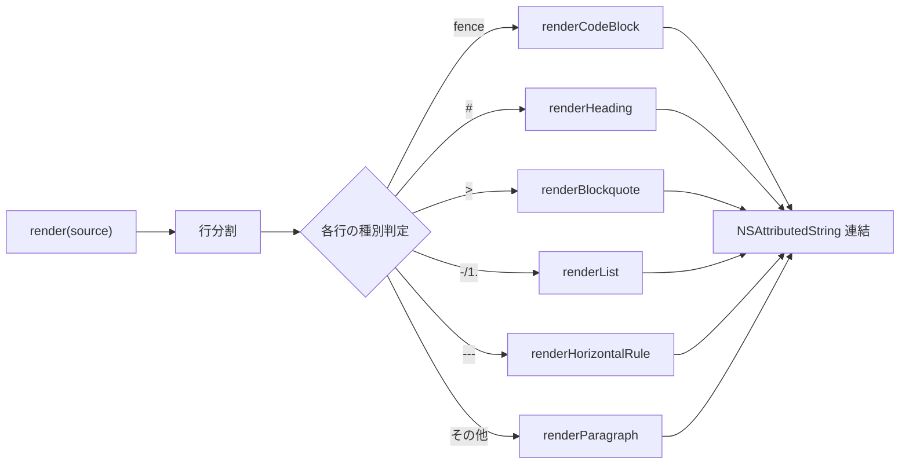

# Markdown プレビュー

`.md` ファイルを開いているときだけ、フッターに 👁️ ボタンが現れます。クリックで **編集モード ⇄ プレビューモード** を切り替えられます。外部ライブラリを使わず、自前のパーサで `NSAttributedString` を組み立てて描画しているのがポイントです。

> 由来: PR #8「.md ファイルのプレビュー機能を追加」

## 使い方

| 状態 | ボタン | 動作 |
| --- | --- | --- |
| 編集中 | 👁️ (`eye`) | プレビューへ切り替え（直前に保存をフラッシュ） |
| プレビュー中 | ✏️ (`pencil`) | 編集へ戻る |

`.txt` ファイルやメモが空のとき、このボタンは表示されません（判定は拡張子 `md`）。

```swift title="ContentView.swift（抜粋）"
private func isMarkdownFile(_ id: String) -> Bool {
    URL(fileURLWithPath: id).pathExtension.lowercased() == "md"
}
```

:::note プレビュー前にフラッシュ
プレビューに入る瞬間に `store.flushPending()` を呼び、保留中の編集を確定させてから最新内容をレンダリングします。「さっき打った行がプレビューに出ない」を防ぎます。
:::

## 対応している記法

`MarkdownRenderer` は次のブロック／インライン要素をサポートします。

### ブロック要素

- 見出し `#`〜`######`（6段階、サイズ可変）
- 箇条書き `-` / `*` / `+`、番号付き `1.` / `1)`、ネスト対応
- タスクリスト `- [ ]` / `- [x]` → ☐ / ☑
- 引用 `>`（左に `│` を付け、イタリック・薄色）
- フェンスドコードブロック ` ``` ` / `~~~`（情報文字列は無視）
- 水平線 `---` / `***` / `___`

### インライン要素

- **太字** `**text**` / `__text__`
- _イタリック_ `*text*` / `_text_`
- `インラインコード` `` `code` ``
- リンク `[label](url)`（`NSColor.linkColor` + 下線、クリック可能）
- バックスラッシュエスケープ `\*` など

## 仕組み

### 行ベースのブロックパーサ

`Parser` は入力を行に分割し、先頭から各行を「これは見出しか／コードフェンスか／リストか…」と判定して対応するレンダラに振り分けます。



### インラインは再帰的に処理

`renderInline` は1文字ずつ走査し、強調やリンクの「中身」を再帰的に処理します。これにより `**太字の中の *イタリック*** ` のような入れ子も描画できます。

```swift title="MarkdownRenderer.swift（強調処理の抜粋）"
if c == "*" || c == "_" {
    if i + 1 < chars.count, chars[i + 1] == c,
       let end = findClosingDouble(chars: chars, marker: c, from: i + 2) {
        let inner = String(chars[(i + 2)..<end])
        var attrs = baseAttributes
        attrs[.font] = boldFont(currentFont)
        result.append(renderInline(inner, baseAttributes: attrs)) // ← 再帰
        ...
    }
}
```

### 表示は読み取り専用の NSTextView

プレビューは編集不可・選択可の `NSTextView`（`AttributedTextView`）で、リンクはポインタカーソルになりクリックで開けます。

:::info ライブラリ非依存の理由
`swift-markdown` などに頼らず内製にすることで、依存ゼロ・ビルドが軽量・描画スタイル（行間や引用の `│` 表現など）を完全に自前で制御できる、というメリットを取っています。その代わり対応記法はサブセットです（テーブル・画像・脚注などは未対応）。
:::
</content>
