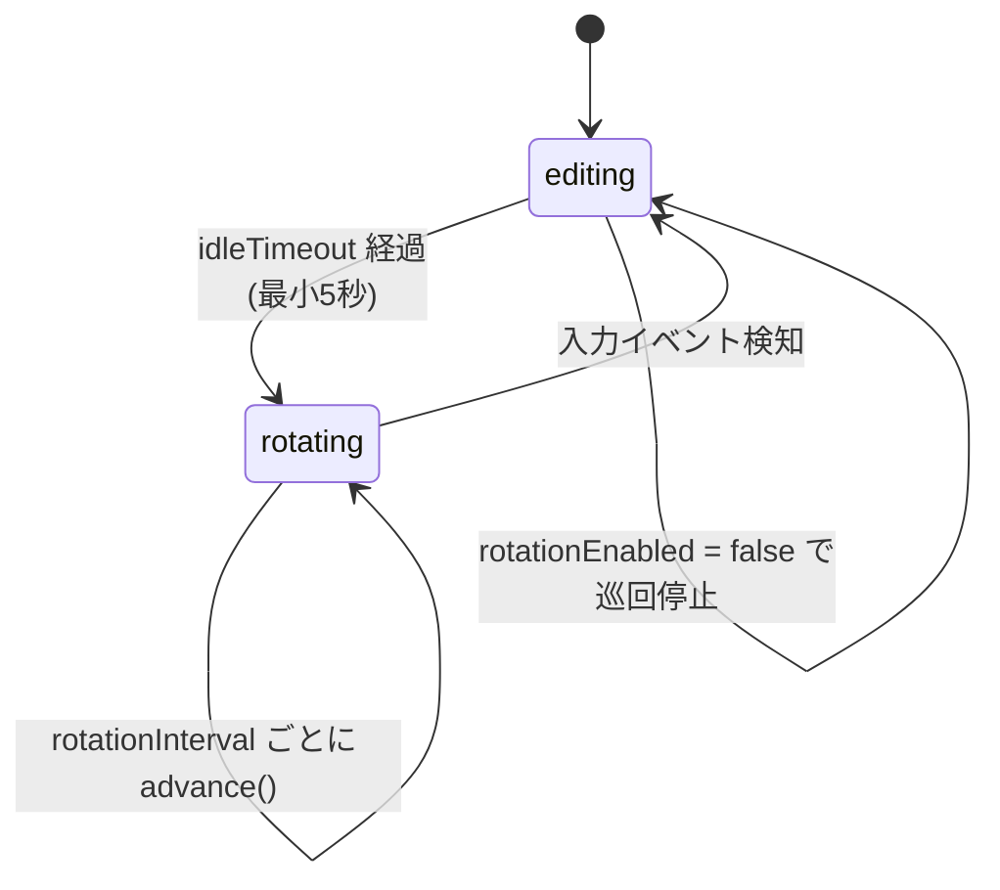

# メモのローテーション表示

MemontoMori の核となる機能です。一定時間ユーザー操作がないと「ローテーションモード」に入り、有効なメモを設定間隔で次々に切り替えて表示します。書いたまま忘れがちなメモを、勝手に目の前へ呼び戻します。

> 由来: PR #2「add memo rotation with idle-trigger screensaver mode」 / PR #7 でローテーションの ON/OFF トグルを追加。

## 2つのモード

`RotationController` は次の状態を持ちます。

```swift
enum Mode: Equatable {
    case editing    // 通常編集中
    case rotating   // 自動巡回中
}
```

| モード | 入る条件 | 抜ける条件 |
| --- | --- | --- |
| `editing` | 起動直後／ユーザー操作後 | アイドルタイムアウト経過 |
| `rotating` | アイドルタイムアウト経過 | キー・クリック・スクロール・テキスト変更 |

フッターのラベルは状態を絵文字で示します。

- `✏️ ファイル名` … 編集中
- `🔄 ファイル名` … ローテーション中
- `⏸ ファイル名` … ローテーション無効（トグル OFF）

## 動作タイムライン



## 設定値

設定パネルから変更でき、`UserDefaults` に保存されます。

| 設定 | 既定値 | 選択肢 | 役割 |
| --- | --- | --- | --- |
| アイドル時間 (`idleTimeout`) | 600秒(10分) | 1/3/5/10/30分 | この時間操作がないと巡回開始 |
| ローテーション間隔 (`rotationInterval`) | 600秒(10分) | 1/5/10/30/60分 | 巡回中に次のメモへ移る間隔 |
| ローテーション有効 (`rotationEnabled`) | ON | フッターでトグル | OFF にすると巡回しない |

:::note 下限ガード
タイマー周期は `max(値, 5)` でクランプされます。設定がどうであれ最短5秒間隔で、暴走を防ぎます。
:::

## 仕組み

### アイドル検知（グローバルではなくローカル監視）

`NSEvent.addLocalMonitorForEvents` でキー・クリック・スクロールを監視し、イベントごとにアイドルタイマーを張り直します。

```swift title="RotationController.swift（抜粋）"
eventMonitor = NSEvent.addLocalMonitorForEvents(
    matching: [.keyDown, .leftMouseDown, .rightMouseDown, .scrollWheel]
) { [weak self] event in
    Task { @MainActor in self?.handleUserInteraction() }
    return event   // イベントは握り潰さずそのまま流す
}
```

`handleUserInteraction()` は、巡回中なら `editing` に戻し、いずれにせよアイドルタイマーを再設定します。

### 巡回ロジック

有効（`isEnabled == true`）なメモだけを対象に、リング状に前後へ移動します。

```swift title="RotationController.swift（抜粋）"
func advance(by step: Int = 1) {
    let enabled = store.enabledEntries
    guard !enabled.isEmpty else { return }
    store.flushPending()  // 保留中の編集を先に保存
    let currentIdx = enabled.firstIndex(where: { $0.id == currentID }) ?? -1
    let nextIdx = ((currentIdx + step) % enabled.count + enabled.count) % enabled.count
    currentID = enabled[nextIdx].id
    store.lastDisplayedID = currentID
}
```

- フッターの `‹` / `›` ボタンは `advance(by: -1)` / `advance(by: 1)` を呼び、手動で巡回できます（有効メモが2件未満なら無効化）。
- 最後に見ていたメモは `lastDisplayedID` として `UserDefaults`（フォルダ単位）に保存され、次回起動時に復元されます。

### 一貫性の維持

`reconcile()` が、ファイルの追加・削除・並べ替え後に呼ばれ、`currentID` が現存しない場合のフォールバック（最後に見たメモ → 先頭の有効メモ → 先頭メモ）を行います。有効メモが空になればローテーションを止めます。

:::tip フォルダを切り替えると
[サブフォルダ](./subdirectories.md)を切り替えると、そのフォルダの `lastDisplayedID` から再開します。フォルダごとに「どこまで見たか」を覚えています。
:::
