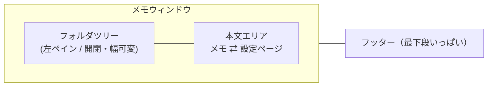

# 設定ページ

歯車ボタン（またはメニューの `設定...` / <kbd>⌘</kbd><kbd>,</kbd>）を押すと、**本文エリアが丸ごと設定ページに切り替わります**。VS Code の設定タブと同じ感覚です。左ペインでフォルダやメモを選ぶと、そのままメモの表示に戻ります。

> 由来: PR #7 で右側の分割パネルとして実装 → PR #15 で設定ページへ移行

## なぜ分割パネルをやめたか

分割パネルには「ファイル一覧・フォルダ選択・作成・動作設定」が同居していました。しかし整理してみると、

- **フォルダやメモの操作**は[フォルダツリー](./folder-sidebar.md)（左ペイン）のほうが自然
- 残った**間隔・アイドル時間・画像切り替え**は、どれもフォルダ単位ではなく**アプリ全体に効く設定**

という分かれ方をしていて、常時表示するペインを 1 つ占有する理由がなくなりました。そこで右ペインは廃止し、全体設定は必要なときだけ開くページにまとめています。



## 設定できること

| 区分 | 設定 |
| --- | --- |
| ローテーション | 自動ローテーションのオン/オフ、[ローテーション間隔、アイドル時間](./memo-rotation.md) |
| 表示 | [画像の切り替えアニメーション](./image-transition.md)、フォルダツリーの表示/非表示 |
| コマンド | [コマンドパレット](./command-palette.md)で使えるコマンドの一覧とキー操作（設定項目ではなく早見表） |
| 保存場所 | メモのルートフォルダのパス表示と Finder で開く |

メモの作成・削除・並べ替え・巡回対象のオン/オフといった**フォルダ単位の操作は[左ペイン](./folder-sidebar.md)**にあります。

## 仕組み

### 本文エリアの差し替え

設定ページを開いているかどうかは `MemoStore.isShowingSettings` が持ちます。ウィンドウ構成を変えずに `mainAreaContent` の分岐を 1 本増やすだけなので、ペインの出し入れに伴うレイアウト計算が要りません。

```swift title="ContentView.swift（抜粋）"
@ViewBuilder
private var mainAreaContent: some View {
    if store.isShowingSettings {
        SettingsPage(store: store)
    } else if store.entries.isEmpty {
        PlainTextEditor(text: $freeMemoText)
    } else if let id = displayedID ?? rotation.currentID {
        ...
    }
}
```

タブのように「開きっぱなしにするもの」ではないので、この状態は `UserDefaults` に永続化していません（左ペインの表示状態や幅は永続化しています）。

### コマンド一覧はカタログを読むだけ

「コマンド」セクションは設定値を持ちません。[コマンドパレット](./command-palette.md)と同じ `CommandCatalog` を読んで、分類ごとにタイトル・説明・ショートカットを並べているだけの早見表です。コマンドを 1 つ足せば、パレットと設定ページの両方に自動で現れます。

```swift title="SettingsPage.swift（抜粋）"
section("コマンド") {
    // ...
    keyHintTable
    ForEach(CommandCategory.allCases) { category in
        commandGroup(category)
    }
}
```

### 開いている間もローテーションは止めない

設定ページを開いている間も裏側のローテーションはそのまま進みます。`isShowingSettings` の分岐が最優先なので、**巡回でメモが切り替わっても設定ページから追い出されることはありません**。閉じれば、そのとき表示すべきメモが出ます。

### 左ペインからの復帰

左ペインでフォルダ行やメモ行を選ぶと `store.isShowingSettings = false` が立ち、本文エリアがメモに戻ります。設定を閉じるためにもう一度歯車を押す必要はありません。

```swift title="FolderSidebar.swift（抜粋）"
private func openMemo(_ ref: MemoRef) {
    store.isShowingSettings = false
    selectFolderIfNeeded(ref.folder)
    rotation.switchTo(id: ref.name)
}
```

:::tip 関連: 自動置換の無効化
分割パネルと同じ PR で、エディタの `NSTextView` のスマートクオート／ダッシュ自動置換をオフにする修正も入っています。`"` が `"` に化けて Markdown が壊れるのを防ぐためのものです。
:::
