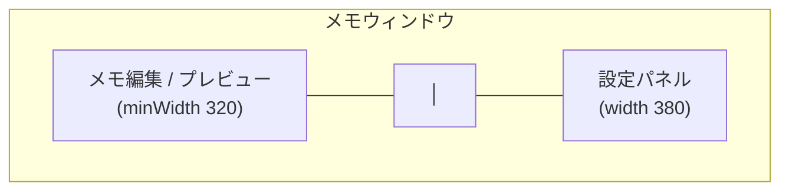

# 分割パネル設定

設定を別ウィンドウで開くのではなく、メモ編集エリアの右側にスッと設定パネルを開く分割レイアウトです。メモを見ながらファイルの並べ替えや間隔調整ができます。

> 由来: PR #7「split-panel layout with settings panel toggle and rotation off」

## 使い方

フッター左端の `sidebar` ボタンで、設定パネルの開閉をトグルします（幅 380pt、アニメーション付き）。パネル開閉でウィンドウ幅が変わっても、ボタンはウィンドウ左下に固定されたままなので、同じ場所をクリックするだけで開閉できます。



パネルを開くとウィンドウ最小幅が `320 + 380` に広がり、閉じると `320` に戻ります。

## 設定パネルでできること

| 区分 | 操作 |
| --- | --- |
| フォルダ | [サブフォルダ](./subdirectories.md)の選択 |
| ファイル一覧 | 有効/無効トグル、ドラッグ並べ替え、削除（ゴミ箱へ） |
| 作成 | 新規メモ・新規フォルダ |
| その他 | Finder で開く、再スキャン |
| 動作設定 | ローテーション間隔、アイドル時間、[画像切り替えアニメーション](./image-transition.md) |

## 仕組み

### 1つの SettingsView を2モードで使い回す

`SettingsView` は `embedded` フラグを持ち、分割パネル（埋め込み）と独立ウィンドウの両方で再利用できます。埋め込み時はウィンドウ最小サイズの強制を外します。

```swift title="SettingsView.swift（抜粋）"
struct SettingsView: View {
    @ObservedObject var store: MemoStore
    @ObservedObject var rotation: RotationController
    /// 埋め込み表示時はウィンドウ最小サイズの強制を外す
    var embedded: Bool = false
    ...
    .frame(
        minWidth: embedded ? 320 : 520,
        minHeight: embedded ? 0 : 460,
        maxWidth: .infinity, maxHeight: .infinity
    )
}
```

### ContentView 側の合成

`ContentView` はメモ列の右に、トグル状態に応じて `Divider` + `SettingsView(embedded: true)` を差し込み、`transition` と `animation` でスライドさせます。

```swift title="ContentView.swift（抜粋）"
HStack(spacing: 0) {
    memoColumn.frame(minWidth: 320, maxWidth: .infinity)
    if showsSettingsPanel {
        Divider()
        SettingsView(store: store, rotation: rotation, embedded: true)
            .frame(width: 380)
            .transition(.move(edge: .trailing).combined(with: .opacity))
    }
}
.animation(.easeInOut(duration: 0.18), value: showsSettingsPanel)
```

### ローテーション OFF トグルとの同梱

同じ PR で、フッターにローテーション ON/OFF トグルが入りました。OFF にすると `RotationController` がアイドルタイマーと巡回タイマーを破棄し、`editing` 固定になります（詳細は[ローテーション](./memo-rotation.md)）。

:::tip 関連: 自動置換の無効化
この一連の改善では、エディタの `NSTextView` でスマートクオート／ダッシュ自動置換をオフにする修正（PR #7 内の fix）も入っています。`"` が `"` に化けて Markdown が壊れるのを防ぎます。
:::
